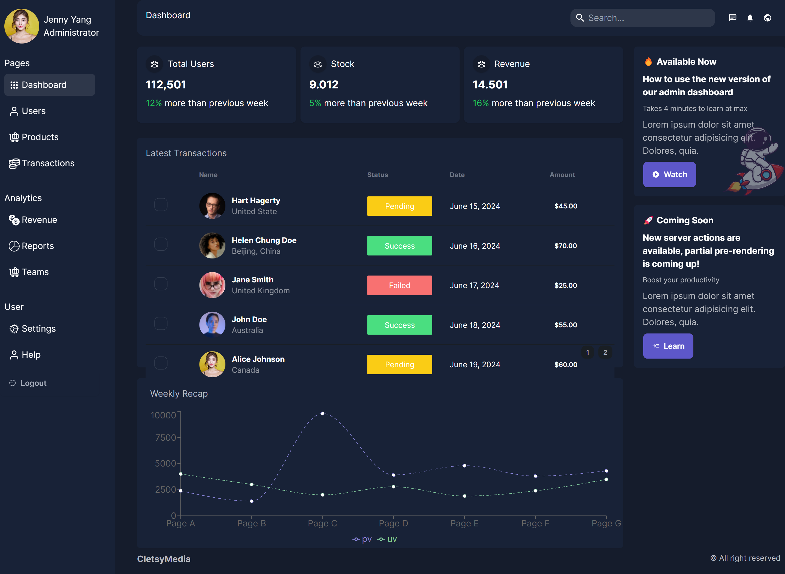

# Admin Dashboard



## 📊 Project Overview

**Admin Dashboard** is a full-stack web application designed to manage user profiles through basic CRUD (Create, Read, Update, Delete) functionalities. This application features user authentication and provides a modern UI for administrators to efficiently manage user profiles.

## 🚀 Table of Contents

- [📊 Project Overview](#-project-overview)
- [🎯 Learning Objectives](#-learning-objectives)
- [🛠 Technologies Used](#-technologies-used)
- [🌐 Third-Party Services Used](#-third-party-services-used)
- [📦 Installation and Setup](#-installation-and-setup)
  - [Clone the Repository](#clone-the-repository)
  - [Install Dependencies](#install-dependencies)
- [🌟 Features](#-features)
  - [User Authentication](#user-authentication)
  - [CRUD Operations](#crud-operations)
  - [Modern UI](#modern-ui)
- [📖 Usage](#-usage)
  - [Authentication](#authentication)
  - [CRUD Operations](#crud-operations)
- [📝 Conclusion](#-conclusion)

## 📝 Project Description

**Admin Dashboard** is a comprehensive web application designed to manage user profiles. The application includes:

- **User Authentication:** Basic user login and registration.
- **CRUD Operations:** Create, view, update, and delete user profiles.
- **Server-Side Rendering:** Enhanced SEO and performance with Next.js.
- **Modern UI:** Built with Tailwind CSS for a sleek and responsive design.

## 🎯 Learning Objectives

- Implement CRUD operations for user profiles.
- Integrate frontend and backend using React (Next.js) for server-side rendering.
- Develop a responsive UI with Tailwind CSS.
- Create secure authentication mechanisms with JSON Web Tokens (JWT).
- Manage user data with MongoDB and MongoDB Atlas.
- Plan and execute project tasks effectively for a software engineering course.

## 🛠 Technologies Used

- **Frontend:**
  - [React](https://reactjs.org/) - JavaScript library for building user interfaces.
  - [Next.js](https://nextjs.org/) - React framework for server-side rendering and static site generation.
  - [Tailwind CSS](https://tailwindcss.com/) - Utility-first CSS framework for modern design.

- **Backend:**
  - [Node.js](https://nodejs.org/) - JavaScript runtime environment.
  - [Express.js](https://expressjs.com/) - Web application framework for Node.js.

- **Database:**
  - [MongoDB](https://www.mongodb.com/) - NoSQL database for storing user profiles.

- **Authentication:**
  - [JSON Web Tokens (JWT)](https://jwt.io/) - Standard for secure token-based authentication.

## 🌐 Third-Party Services Used

- **[MongoDB Atlas](https://www.mongodb.com/cloud/atlas)** - Cloud-hosted MongoDB service for database management.

## 📦 Installation and Setup

To get started with the Admin Dashboard project, follow these steps:

### Clone the Repository

```bash
git clone https://github.com/your-username/admin-dashboard.git
cd admin-dashboard
```

## Install Dependencies

```bash
npm install
Visit http://localhost:3000/dashboard in your web browser to access the application.
```

## 🌟 Features

### User Authentication

- **Basic user registration and login functionality.**

### CRUD Operations

- **Create, Read, Update, Delete** user profiles with a modern interface.

### Modern UI

- A clean and responsive design created with [Tailwind CSS](https://tailwindcss.com/).
- Server-side rendering with [Next.js](https://nextjs.org/) for improved performance and SEO.

## 📖 Usage

### Authentication

- **Register:** Navigate to the registration page to create a new account.
- **Login:** Log in with your credentials to access the admin dashboard.

### CRUD Operations

- **View User Profiles:** Access the list of user profiles from the dashboard.
- **Add New User:** Use the form to create a new user profile.
- **Edit User Profile:** Click the edit button to update user details.
- **Delete User Profile:** Remove a user profile using the delete button.

## 📝 Conclusion

The **Admin Dashboard** project showcases the integration of modern web technologies and best practices to create a robust and user-friendly application for managing user profiles. Please note that some features might not be fully functional yet; stay tuned for updates as improvements are continuously made. By leveraging React, Next.js, Tailwind CSS, and MongoDB, this project offers a scalable and maintainable solution for administrative tasks. 

Feel free to explore, contribute, and build upon this project. For any issues or enhancements, open an issue or submit a pull request!

Thank you for checking out the Admin Dashboard project!